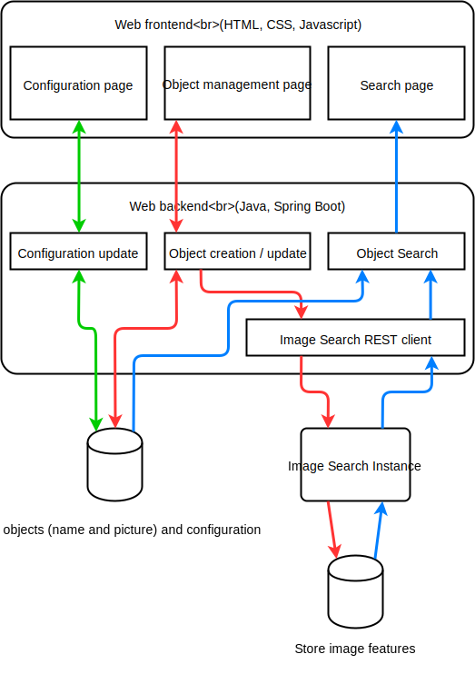

# Image Search Workshop

## Summary
0. [Introduction](#introduction)
1. [Prerequisite](#prerequisite)
2. [Usage](#usage)
3. [Run as a linux daemon](#run-as-a-linux-daemon)
4. [Tips](#tips)
5. [Online demo page](#online-demo-page)
6. [Thanks](#thanks)

## Introduction
This is a demo workshop that showcases [Image Search](https://www.alibabacloud.com/help/product/66413.htm), an
Alibaba Cloud image search service. After its completion, you will be able to upload images and try to search
them by uploading a similar picture.

This demo is a website compatible with desktop computers and smartphones. It contains two main pages:
* *Manage objects*

    This page allows users to add/update/delete product images in the database.
    
* *Home*

    This page lets users to search for products that look similar to an uploaded photo (this photo can come from a
    JPEG file or directly from a camera when the user views this page on a smartphone).

The following diagram represents the demo architecture:



There are two databases: one for storing names & images of registered objects, and one managed by the 
[Image Search instance](https://www.alibabacloud.com/help/doc-detail/66569.htm) (it only stores selected image
features required for searches). Both databases are synchronized via object UUIDs.

## Prerequisite
### Product Search instance
Before running the application, you first need to create a
[Product Search instance](https://www.alibabacloud.com/help/doc-detail/66569.htm) that will allow you to use the
[image search API](https://www.alibabacloud.com/help/doc-detail/66616.htm):

0. Create an Alibaba cloud account

    If you don't have an account, please follow
    [this document to create one](https://www.alibabacloud.com/help/doc-detail/50482.htm).

1. Create a Product Search instance

    You need an *Product Search instance*. You can create it from
    [Product Search console](https://imagesearch.console.aliyun.com/product-search).
    For more information, please read [this document](https://www.alibabacloud.com/help/doc-detail/66569.htm).

    If you want, you can also create an [ECS instance](https://www.alibabacloud.com/help/product/25365.htm).

2. Create an access key

    You need an accessKeyId and an accessKeySecret to access your Product Search instance. Please follow
    [this document to obtain an access key id and secret](https://www.alibabacloud.com/help/faq-detail/63482.htm).

### Local environment requirements
This application requires the following environment:
* GNU Linux (CentOS 7.4+ is recommended), MAC OSX or Windows
* A Java development environment:
    * [JDK 8+](https://adoptopenjdk.net/)
    * [Apache Maven](https://maven.apache.org/)

You can check your environment with the following commands in a terminal:
```bash
# Check that Java JDK is installed
javac -version

# Check that Maven is installed
mvn -v
```

You can check what Java version you have and change it with the following commands:
```bash
# CentOS
sudo alternatives --config java

# Mac
/usr/libexec/java_home -V
export JAVA_HOME=`/usr/libexec/java_home -v 1.8`
```

## Usage
1. Build the demo

    Run the following commands.

    ```bash
    # Change directory if needed
    cd /path/to/your/projects

    # Clone the project
    git clone https://github.com/alibabacloud-howto/image-search-workshop.git

    # Install and Build the project
    mvn clean install

    # Run the project
    mvn spring-boot:run
    ```

    Of course, you can use an IDE (e.g. IntelliJ IDEA) to import, build and run this project.
    
    > Note: you can use the following command to only build the project (skip tests):
    ```bash
    mvn package -Dmaven.test.skip=true
    ```

2. Try the demo

    1. Configure the demo
        * Open your web browser and access to "http://localhost:8080/".
        * If this is the first time you use the application, you will be redirected to the configuration page.
        * Enter your access key and "Product Search instance" details (you can ignore "OSS Base image URL").

    2. Access to the *Manage objects* page
        * You can add/update/delete products here.
        * It displays all the sample products registered in the database.

    3. Return to the *Home* page
        * You can upload an image and see the image search result here.
        * If you have added enough products, you should always see 20 results with various scores.

## Run as a linux daemon
1. Create a RPM package

    If you plan to install this demo on a RPM-based Linux distribution, you can type the following command:
    ```
    mvn rpm:rpm
    ```

    This generates the package "target/rpm/web-image-search-engine/RPMS/noarch/web-image-search-engine-*.noarch.rpm".
    The RPM contains the fat JAR and a Systemd script. It allows users to easily execute the server when the machine
    starts. It also automatically restarts the application after a crash.

    If you just want to run the fat JAR, open a terminal and run the command:
    ```
    java -jar web-image-search-engine-latest.jar
    ```

    This starts the server on the port 8080 and outputs the logs in the console.

2. Install the RPM package

    If you are using a RPM-based Linux distribution, such as CentOS 7.4+, you can install the RPM with the following commands:
    ```
    sudo yum -y update
    sudo yum -y install path/to/web-image-search-engine-latest.noarch.rpm
    ```

3. Execute the service

    You can start the server with the following command:
    ```
    sudo systemctl start web-image-search-engine.service
    ```

    You can check the logs by running the following command:
    ```
    sudo journalctl --unit=web-image-search-engine
    ```

    The server should start and listen to the port 8080. If you prefer to use the port 80, you can setup a reverse proxy
    such as [Nginx](https://www.linode.com/docs/development/java/how-to-deploy-spring-boot-applications-nginx-ubuntu-16-04/#reverse-proxy).

    If you want to automatically run the server when the machine starts, enter the following command:
    ```
    sudo systemctl enable web-image-search-engine.service
    ```


## Tips

After many searches you will find that the results are not always meaningful. For example you will get 20 results even
if you search with a picture of an object that doesn't exist in the database (in fact, the value "20" is hardcoded in
the demo source code). This is a limitation of this API, and there is no simple solution. The absolute value of the
score doesn't help (unless you search with the exact same picture as a registered object), only its relative value
can be used for sorting results.

There are few solutions for this problem:
* Have a huge database of images, like [Taobao](https://www.taobao.com/).
* Teach the Image Search API to recognize bad results: for example if the customer only sells furniture, then non-furniture objects should also be registered in the database and marked as "BAD", like this the program can filter the Image Search results by removing the BAD objects.


## Online demo page
[http://imagesearch.abcdemo.cc/](http://imagesearch.abcdemo.cc/)


## Thanks
This application uses the following libraries/frameworks/tools:
* Backend
  * [Spring Boot](https://spring.io/projects/spring-boot)
  * [H2 Database Engine](http://www.h2database.com)
  * [Hibernate](http://hibernate.org/)
  * [Apache Commons IO](https://commons.apache.org/proper/commons-io/)
  * [Apache Commons Lang](https://commons.apache.org/proper/commons-lang/)
  * [Alibaba Cloud SDK for Java](https://github.com/aliyun/aliyun-openapi-java-sdk)
* Frontend
  * [Bootstrap](https://getbootstrap.com/)
  * [jQuery](https://jquery.org/)
  * [Lodash](https://lodash.com/)
  * [Open Iconic](https://useiconic.com/open/)
  * [Draggabilly](https://draggabilly.desandro.com/)
* Backend testing
  * [Maven Surefire Plugin](http://maven.apache.org/surefire/maven-surefire-plugin/)
  * [Mockito](http://site.mockito.org/)
  * [JaCoCo](https://www.jacoco.org/)
* Build
  * [Jenkins](https://jenkins.io/)
  * [SonarQube](https://www.sonarqube.org/)
  * [RPM Maven Plugin](https://www.mojohaus.org/rpm-maven-plugin/)
